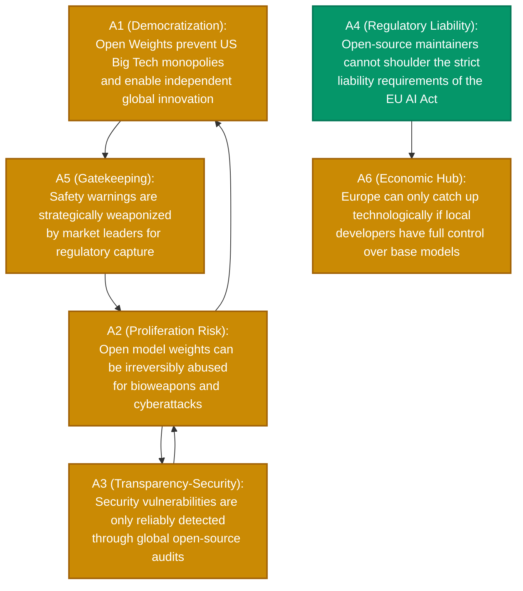

```text
       _           _                  
      | |         | |                 
   ___| | __ _ ___| |__  _ __  _   _  
  / __| |/ _` / __| '_ \| '_ \| | | | 
 | (__| | (_| \__ \ | | | |_) | |_| | 
  \___|_|\__,_|___/_| |_| .__/ \__, | 
                        | |     __/ | 
                        |_|    |___/  
 Automated Argumentation Reasoning Engine ⚡
```

# clashpy ⚡

> **Raw LLM noise in, mathematically proven conflict topology out.**  
A lightweight, modular proof-of-concept for automated argumentation mining and formal reasoning. It ingests live news streams, extracts claims & attacks via LLMs, and computes stable, defensible perspectives using Dung's Abstract Argumentation Frameworks.

---

## Quickstart

```bash
# 1. Sync dependencies with uv
uv sync

# 2. Run analysis directly
uv run clashpy "AI Regulation" --solver naive --export-md --export-mmd
```

---

## Project Structure

```
clashpy/
├── pyproject.toml
├── spec/
│   └── system_specification.md  # Comprehensive technical specification & LLM prompt blueprint
├── docs/
│   ├── poster_en.pdf            # High-resolution architectural infographic (PDF)
│   ├── poster_en.png            # High-resolution architectural infographic (PNG)
│   └── poster_en.html           # Interactive poster template (SVG/CSS)
├── tests/
│   └── test_core.py             # Unit tests for Dung semantics, solvers, and metrics
└── src/
    └── clashpy/                 # Core package source
        ├── core/                # Domain models, DuckDB cache, hashing, solvers & metrics
        │   ├── models.py
        │   ├── hashing.py
        │   ├── cache.py
        │   ├── solver.py
        │   └── metrics.py
        ├── adapters/            # Interchangeable ports & adapters (News, Solvers)
        │   ├── news_sources/
        │   │   ├── base.py
        │   │   └── rss_source.py
        │   └── solvers/
        │       └── pygarg_solver.py
        ├── llm/                 # Lazy-initialized Pydantic-AI agents
        │   └── agents.py
        ├── pipeline.py          # End-to-end pipeline orchestrator
        ├── cli.py               # CLI interface & export manager
        └── doc_generator.py     # Automated poster & doc generator
```

---

## Key Features & Highlights

- **Decoupled Hexagonal Architecture (Ports & Adapters)**: Core graph reasoning is strictly decoupled from ingestion and solvers. Switch from the naive backtracking solver to an external SAT solver (`pygarg`) via a CLI flag without modifying pipeline code.
- **Zero-Leakage Secret Resolution**: Automatically loads API keys using a multi-tier fallback: `os.environ` → local `.env` → encrypted OS Keyring (`service="db.syst.datahub"`).
- **Deterministic DuckDB Caching**: All news queries, LLM extraction calls, and solver computations are hashed via SHA-256 and cached in DuckDB to minimize latency and eliminate redundant LLM API costs.
- **Topological Conflict Analysis**:
  - **Preferred Extensions**: Maximal conflict-free and mutually defended argument sets.
  - **Dilemma Axes**: Automatic detection of symmetric attacks ($A \leftrightarrow B$) representing core ideological disagreements.
  - **Acceptance Scores**: Argument classification into *Core Consensus* ($1.0$), *Contested* ($0 < s < 1$), or *Excluded* ($0.0$).
- **Multi-Format Export**: Generates timestamped Markdown reports (`.md`), standalone Mermaid diagrams (`.mmd`), and raw JSON payloads under `output/`.

---

## Installation & Setup

1. **Prerequisites**: Python `>= 3.12`, [uv package manager](https://github.com/astral-sh/uv).
2. **Install dependencies**:
   ```bash
   uv sync
   ```
3. **Configure API Keys**:
   Copy `.env.example` to `.env` or store your Gemini API key in your OS keyring:
   ```bash
   cp .env.example .env
   # Add your GOOGLE_API_KEY
   ```

---

## CLI Usage

Run analysis via the registered command:

```bash
uv run clashpy "Should electric scooters be banned in city centers?" [OPTIONS]
```

### CLI Options

| Option | Description | Default |
| :--- | :--- | :--- |
| `topic` / `--topic` | Debate topic or inquiry (positional or flag) | `""` |
| `--solver` | Chosen solver algorithm (`naive` or `pygarg`) | `naive` |
| `--semantics` | Formal semantics (`PR`, `ST`, `CO`, `GR`) | `PR` (Preferred) |
| `--model` | LLM model identifier (supports Google, OpenAI, Anthropic, Ollama, etc.) | `google:gemini-3.5-flash` |
| `--export-md` | Export structured Markdown analysis report to `output/` | Disabled |
| `--export-mmd` | Export Mermaid diagram to `output/` | Disabled |
| `--output-json` | Save complete raw JSON analysis payload to path | `None` |
| `--refresh` | Bypass DuckDB cache and force fresh extraction | `False` |

---

## Supported LLM Providers

Thanks to `pydantic-ai`, `clashpy` natively supports all major LLM providers simply by passing the `--model` flag and setting the corresponding environment variable or keyring secret:

| Provider | Example Model String | Required API Key / Env Variable |
| :--- | :--- | :--- |
| **Google Gemini** (Default) | `google:gemini-3.5-flash` | `GOOGLE_API_KEY` |
| **OpenAI** | `openai:gpt-4o-mini` or `openai:gpt-4o` | `OPENAI_API_KEY` |
| **Anthropic Claude** | `anthropic:claude-3-5-sonnet-latest` | `ANTHROPIC_API_KEY` |
| **Mistral AI** | `mistral:mistral-large-latest` | `MISTRAL_API_KEY` |
| **Groq (Llama 3)** | `groq:llama-3.3-70b-versatile` | `GROQ_API_KEY` |
| **LM Studio** (Local / Offline) | `lmstudio:local-model` | None (LM Studio local server on `http://localhost:1234/v1`) |
| **Local Ollama** (Offline) | `ollama:llama3.2` | None (requires local Ollama server running) |
| **Offline Test Mode** | `test` | None (built-in deterministic mock) |

### Examples with alternative LLMs:

```bash
# Using OpenAI GPT-4o-mini
OPENAI_API_KEY="sk-..." uv run clashpy "AI Regulation" --model openai:gpt-4o-mini

# Using Anthropic Claude 3.5 Sonnet
ANTHROPIC_API_KEY="sk-ant-..." uv run clashpy "AI Regulation" --model anthropic:claude-3-5-sonnet-latest

# Using local LM Studio (start local server in LM Studio on port 1234)
uv run clashpy "AI Regulation" --model lmstudio:local-model

# Using local Ollama (completely offline & free)
uv run clashpy "AI Regulation" --model ollama:llama3.2

# Testing without any API key or network
uv run clashpy "AI Regulation" --model test
```

---

## Showcase: Real-World Example Output

To illustrate the output of `clashpy`, see the comprehensive analysis of the fundamental tech debate **"Open-Source AI (Open Weights) vs. Closed-Source Gatekeeping"**:

- 🇩🇪 **[German Showcase Report (`docs/showcase_opensource_ai_de.md`)](docs/showcase_opensource_ai_de.md)**
- 🇬🇧 **[English Showcase Report (`docs/showcase_opensource_ai_en.md`)](docs/showcase_opensource_ai_en.md)**

### Sample Rendered Output



- **Perspective 1 (Sovereignty & Transparency):** `{A1, A3, A4, A5}` – Open-source AI is essential to combat digital dependency; risks are neutralized by transparency and exposing regulatory capture.
- **Perspective 2 (Security Imperative):** `{A2, A4}` – The irreversible risk of misuse outweighs innovation benefits, mandating shielded API gatekeepers.
- **Detected Dilemma Axis:** `A2 ↔ A3` – Fundamental trade-off between *Security through Obscurity* versus *Security through Transparency*.

---

## Documentation & Poster Generator

`clashpy` includes an automated visual documentation generator:

```bash
# Generate German and English visual posters (HTML, PDF, PNG)
uv run generate-docs --language all

# Watch mode: Automatically regenerates posters on code change
uv run generate-docs --watch --language all
```

Generated assets under `docs/`:
- 📄 `docs/poster_en.pdf` (Print-ready landscape vector PDF)
- 🖼️ `docs/poster_en.png` (High-res 1600x1200 preview)
- 🌐 `docs/poster_en.html` (Standalone interactive web poster)

---

## Running Tests

Unit tests verify the core graph algorithms, naive solver, and metrics:

```bash
uv run pytest
```

---

## AI Implementation Specification

A formal technical specification covering Dung's semantics, mathematical proofs, negative constraints (anti-patterns), and extension guidelines is available at:  
👉 **[`spec/system_specification.md`](spec/system_specification.md)**

---

## License

MIT License. See [LICENSE](LICENSE) for details.
