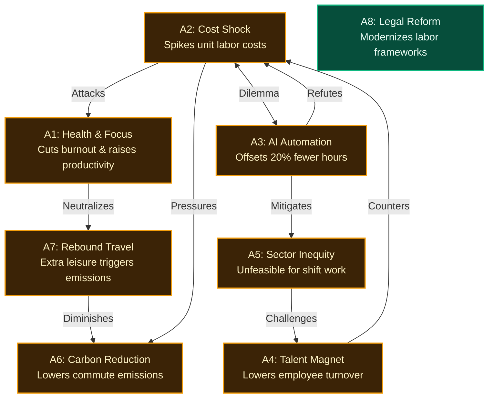

```text
       _           _                  
      | |         | |                 
   ___| | __ _ ___| |__  _ __  _   _  
  / __| |/ _` / __| '_ \| '_ \| | | | 
 | (__| | (_| \__ \ | | | |_) | |_| | 
  \___|_|\__,_|___/_| |_| .__/ \__, | 
                        | |     __/ | 
                        |_|    |___/  
Automated Argumentation Reasoning Engine
```

# clashpy

> **From unstructured data to formally derived conflict structures.**  
A lightweight, modular proof-of-concept for automated argumentation mining and formal reasoning. It ingests live news streams, extracts claims and attacks via LLMs, and derives perspectives using Dung's Abstract Argumentation Frameworks.

---

## Quickstart

```bash
# 1. Sync dependencies with uv
uv sync

# 2a. Run analysis with Cloud LLM (Gemini / Qwen / OpenAI)
uv run clashpy "4-Day Work Week" --export-html --export-md

# 2b. Run 100% locally & offline on Apple Silicon (M-Series / Ollama)
uv run clashpy "4-Day Work Week" --model apple --export-html --export-md
```

---

## Project Structure

```text
clashpy/
├── pyproject.toml
├── sources.yaml                 # Multi-perspective news sources (International, National, Tech, Business)
├── spec/
│   └── system_specification.md  # Comprehensive technical specification & LLM prompt blueprint
├── docs/
│   ├── poster_en.pdf            # High-resolution architectural infographic (PDF)
│   ├── poster_en.png            # High-resolution architectural infographic (PNG)
│   └── poster_en.html           # Interactive poster template (SVG/CSS)
├── tests/
│   ├── test_collaborative_agents.py # Unit tests for Advocatus, Skeptiker, and Cross-Examiner debate
│   ├── test_dense_filter.py     # Unit tests for local sub-ms Apple Silicon argument pre-filter
│   ├── test_core.py             # Unit tests for Dung semantics, solvers, and metrics
│   ├── test_cytoscape.py        # Unit tests for Cytoscape elements and HTML generation
│   ├── test_sources.py          # Unit tests for YAML config and Search adapters
│   └── test_rss_source.py       # Unit tests for parallel RSS ingestion and timeouts
└── src/
    └── clashpy/                 # Core package source
        ├── core/                # Domain models, DuckDB cache, hashing, solvers & metrics
        │   ├── models.py
        │   ├── hashing.py
        │   ├── cache.py
        │   ├── solver.py
        │   └── metrics.py
        ├── adapters/            # Interchangeable ports & adapters (News, Solvers, Classifiers)
        │   ├── classifiers/
        │   │   └── dense_filter.py
        │   ├── news_sources/
        │   │   ├── base.py
        │   │   ├── sources_config.py
        │   │   ├── search_source.py
        │   │   ├── composite_source.py
        │   │   └── rss_source.py
        │   └── solvers/
        │       └── pygarg_solver.py
        ├── llm/                 # Lazy-initialized Pydantic-AI agents
        │   └── agents.py
        ├── cytoscape.py         # Cytoscape.js graph converter, JSON & HTML dashboard
        ├── pipeline.py          # End-to-end pipeline orchestrator
        ├── cli.py               # CLI interface & export manager
        └── doc_generator.py     # Automated poster & doc generator
```

---

## Key Features & Highlights

- **Collaborative Multi-Agent Debate Engine**: Employs specialized adversarial sub-agents (**Advocatus** for supportive claims, **Skeptiker** for risks and counter-theses, and **Cross-Examiner** for strict Dung attack inference) to guarantee balanced 50:50 perspective diversity without single-prompt bias.
- **Sub-Millisecond Dense Argument Pre-Filter**: Scans news corpora locally on CPU/Neural Engine before LLM invocation, stripping boilerplate and noise down to information-dense argument premises (~75% token reduction).
- **Apple Silicon (Metal GPU) Native Execution**: Runs 100% locally and offline on Apple Silicon / Metal GPU via Ollama (`--model apple` or `--model ollama:qwen2.5:7b`) with zero token costs and sub-second TTFT.
- **Multi-Feed Ingestion & Bias Mitigation**: Automatically aggregates across multiple distinct RSS news feeds (BBC, Reuters, Al Jazeera, NYT, Tagesschau, Zeit, Heise) defined in `sources.yaml` to eliminate single-source editorial bias.
- **Topic-Targeted Deep Search (Google News Search)**: Allows targeted topic queries across the past 7–30 days (`--search` / `--search-time 30d`) instead of relying solely on transient frontpage headlines.
- **Multi-Perspective Source Filtering in Cytoscape.js**: Filter arguments interactively by media category (*International Leitmedien*, *Nationale Leitmedien*, *Tech & Fachpresse*, *Wirtschaft & Policy*, *Deep Search*).
- **Decoupled Hexagonal Architecture (Ports & Adapters)**: Core graph reasoning is strictly decoupled from ingestion and solvers. Switch from the naive backtracking solver to an external SAT solver (`pygarg`) via a CLI flag without modifying pipeline code.
- **Zero-Leakage Secret Resolution**: Automatically loads API keys using a multi-tier fallback: `os.environ` → local `.env` → encrypted OS Keyring (`service="db.syst.datahub"`).
- **Deterministic DuckDB Caching**: All news queries, LLM extraction calls, and solver computations are hashed via SHA-256 and cached in DuckDB to minimize latency and eliminate redundant LLM API costs.
- **Topological Conflict Analysis**:
  - **Preferred Extensions**: Maximal conflict-free and mutually defended argument sets.
  - **Dilemma Axes**: Automatic detection of symmetric attacks ($A \leftrightarrow B$) representing core ideological disagreements.
  - **Acceptance Scores**: Argument classification into *Core Consensus* ($1.0$), *Contested* ($0 < s < 1$), or *Excluded* ($0.0$).
- **Multi-Format Export & Interactive Visualizations**: Generates timestamped Markdown reports (`.md`), standalone Mermaid diagrams (`.mmd`), interactive **Cytoscape.js HTML dashboards** with live extension filtering and hierarchy layouts, and raw JSON payloads under `output/`.

---

## Installation & Setup

1. **Prerequisites**: Python `>= 3.12`, [uv package manager](https://github.com/astral-sh/uv).
2. **Install dependencies**:
   ```bash
   uv sync
   ```
3. **Configure API Keys**:
   Copy `.env.example` to `.env` or store your Gemini API key in your OS keyring:
   ```bash
   cp .env.example .env
   # Add your GOOGLE_API_KEY
   ```

---

## CLI Usage

Run analysis via the registered command:

```bash
uv run clashpy "4-Day Work Week" [OPTIONS]
```

### CLI Options

| Option | Description | Default |
| :--- | :--- | :--- |
| `topic` / `--topic` | Debate topic or inquiry (positional or flag) | `""` |
| `--source-yaml` | Path to YAML sources configuration | `sources.yaml` |
| `--search` / `--no-search` | Enable/disable deep topic-targeted Google News search | `True` |
| `--search-time` | Search time window (e.g. `7d`, `14d`, `30d`) | `30d` |
| `--source` | Single feed URL or comma-separated list of RSS feeds (overrides YAML/Search) | `None` |
| `--solver` | Chosen solver algorithm (`naive` or `pygarg`) | `naive` |
| `--semantics` | Formal semantics (`PR`, `ST`, `CO`, `GR`) | `PR` (Preferred) |
| `--model` | LLM model identifier (supports Google, OpenAI, Anthropic, Ollama, etc.) | `google:gemini-3.5-flash` |
| `--export-md` | Export structured Markdown analysis report to `output/` | Disabled |
| `--export-mmd` | Export Mermaid diagram to `output/` | Disabled |
| `--export-html` | Export interactive Cytoscape.js HTML visualization dashboard to `output/` | Disabled |
| `--export-cytoscape` | Export Cytoscape.js graph JSON payload to `output/` | Disabled |
| `--output-json` | Save complete raw JSON analysis payload to path | `None` |
| `--max-articles` | Maximum number of aggregated news items fed to the LLM | `60` |
| `--dense-filter` / `--no-dense-filter` | Enable/disable sub-millisecond local argument density pre-filter | `True` |
| `--naive-max-arguments` | Maximum argument capacity accepted by the naive solver | `35` |
| `--refresh` | Bypass DuckDB cache and force fresh extraction | `False` |

---

## Local Offline Execution (Apple Silicon / Ollama)

Run `clashpy` 100% locally with zero external API calls and zero token costs on any Apple Silicon Mac:

```bash
# 1. Start Ollama with Qwen 2.5 on Apple Silicon Metal
ollama run qwen2.5:7b

# 2. Run clashpy using the local Apple Silicon model alias
uv run clashpy "4-Day Work Week" --model apple --export-html --export-md
```

### Apple Silicon Optimization Highlights:
* **Sub-millisecond Pre-Filter (`dense_filter`):** Scans news corpus locally on CPU/Neural Engine, pruning boilerplate and noise down to high-density argument sentences (~75% token reduction).
* **Metal GPU Acceleration:** Generates structured argument graphs locally in seconds with Qwen 2.5 (7B or 14B).

---

## News Sources Configuration (`sources.yaml`)

`clashpy` organizes news feeds in `sources.yaml` across four distinct media categories to ensure balanced, multi-perspective discourse:

```yaml
sources:
  # 1. International Leitmedien
  - name: BBC World News
    category: international
    url: https://feeds.bbci.co.uk/news/world/rss.xml
  - name: Reuters World
    category: international
    url: https://www.reutersagency.com/feed/?taxonomy=markets-news&post_type=best
  - name: Al Jazeera English
    category: international
    url: https://www.aljazeera.com/xml/rss/all.xml

  # 2. Nationale Leitmedien (DACH)
  - name: Tagesschau
    category: national
    url: https://www.tagesschau.de/index~rss2.xml
  - name: ZEIT ONLINE
    category: national
    url: https://www.zeit.de/news/index

  # 3. Wirtschaft & Policy
  - name: Handelsblatt
    category: business
    url: https://www.handelsblatt.com/contentexport/feed/top-themen

  # 4. Tech & Fachpresse
  - name: Heise Online
    category: tech
    url: https://www.heise.de/rss/heise-atom.xml
```

---

## Supported LLM Providers

Thanks to `pydantic-ai`, `clashpy` natively supports all major LLM providers simply by passing the `--model` flag and setting the corresponding environment variable or keyring secret:

| Provider | Example Model String | Required API Key / Env Variable |
| :--- | :--- | :--- |
| **Apple Silicon (Lokal & Offline)** | `--model apple` or `ollama:qwen2.5:7b` | Keine (Ollama lokal auf Metal GPU) |
| **Google Gemini** (Default) | `google:gemini-3.5-flash` | `GOOGLE_API_KEY` |
| **Qwen 2.5 (DeepInfra - Ultra-Günstig)** | `deepinfra:Qwen/Qwen2.5-72B-Instruct` | `DEEPINFRA_API_KEY` (~$0.13 / 1M Tokens) |
| **Qwen 2.5 (Groq - Ultra-Schnell)** | `groq:qwen-2.5-32b` | `GROQ_API_KEY` (Free Tier / Cent-Beträge) |
| **Qwen 2.5 (OpenRouter)** | `openrouter:qwen/qwen-2.5-72b-instruct` | `OPENROUTER_API_KEY` |
| **Qwen 2.5 (Alibaba DashScope)** | `dashscope:qwen-plus` or `dashscope:qwen-turbo` | `DASHSCOPE_API_KEY` |
| **Qwen 2.5 (Lokal & Kostenlos)** | `ollama:qwen2.5:7b` or `lmstudio:qwen2.5-7b` | Keine (Ollama / LM Studio lokal) |
| **OpenAI** | `openai:gpt-4o-mini` or `openai:gpt-4o` | `OPENAI_API_KEY` |
| **Anthropic Claude** | `anthropic:claude-3-5-sonnet-latest` | `ANTHROPIC_API_KEY` |
| **Mistral AI** | `mistral:mistral-large-latest` | `MISTRAL_API_KEY` |
| **Groq (Llama 3)** | `groq:llama-3.3-70b-versatile` | `GROQ_API_KEY` |
| **Offline Test Mode** | `test` | None (built-in deterministic mock) |

### Examples with alternative LLMs:

```bash
# 1. Qwen 2.5 72B via DeepInfra (Unschlagbar günstig: ~$0.13 pro 1M Tokens)
DEEPINFRA_API_KEY="..." uv run clashpy "Israel Gaza" --model deepinfra:Qwen/Qwen2.5-72B-Instruct

# 2. Qwen 2.5 32B via Groq (Extrem schnell, Free-Tier / minimale Kosten)
GROQ_API_KEY="..." uv run clashpy "Israel Gaza" --model groq:qwen-2.5-32b

# 3. Qwen 2.5 via OpenRouter
OPENROUTER_API_KEY="..." uv run clashpy "Israel Gaza" --model openrouter:qwen/qwen-2.5-72b-instruct

# 4. Qwen 2.5 lokal über Ollama (100% kostenlos & offline)
uv run clashpy "Israel Gaza" --model ollama:qwen2.5:7b

# 5. Using OpenAI GPT-4o-mini
OPENAI_API_KEY="sk-..." uv run clashpy "AI Regulation" --model openai:gpt-4o-mini

# Using Anthropic Claude 3.5 Sonnet
ANTHROPIC_API_KEY="sk-ant-..." uv run clashpy "AI Regulation" --model anthropic:claude-3-5-sonnet-latest

# Using local LM Studio (start local server in LM Studio on port 1234)
uv run clashpy "AI Regulation" --model lmstudio:local-model

# Using local Ollama (completely offline & free)
uv run clashpy "AI Regulation" --model ollama:llama3.2

# Testing without any API key or network
uv run clashpy "AI Regulation" --model test
```

---

## Showcase: Real-World Example Output

To illustrate the output of `clashpy`, see the comprehensive analysis of the debate **"4-Day Work Week with Equal Pay"**:

- **[German Showcase Report (`docs/showcase_4day_week_de.md`)](docs/showcase_4day_week_de.md)**
- **[English Showcase Report (`docs/showcase_4day_week_en.md`)](docs/showcase_4day_week_en.md)**

### Semantic Status Legend & Formal Acceptance

`clashpy` evaluates mathematical acceptance scores based on Dung's Preferred Semantics:

| Status | Bar | Score ($s$) | Dung Semantics Definition | Discourse Implication |
| :--- | :---: | :---: | :--- | :--- |
| **Core Consensus** | `████` | **`1.00`** | In **all** Preferred Extensions | **Unattacked / Defended Baseline**: Valid in every computed perspective |
| **Contested** | `██░░` | **`0.01 – 0.99`** | In **some** Extensions | **Ideological Conflict**: Valid only under specific assumptions / trade-offs |
| **Excluded** | `░░░░` | **`0.00`** | In **no** Extension | **Refuted / Dominated**: Defeated by counter-arguments |
| **Dilemma Axis** | `<->` | **`A ↔ B`** | Symmetric mutual attack | **Irreconcilable Trade-off**: Core structural dilemma of the debate |

---

### Pure CLI & System Output

```text
       _           _                  
      | |         | |                 
   ___| | __ _ ___| |__  _ __  _   _  
  / __| |/ _` / __| '_ \| '_ \| | | | 
 | (__| | (_| \__ \ | | | |_) | |_| | 
  \___|_|\__,_|___/_| |_| .__/ \__, | 
                        | |     __/ | 
                        |_|    |___/  
 Automated Argumentation Reasoning Engine

======================================================================
ANALYSIS RESULTS
======================================================================
Topic:         4-Day Work Week (Equal Pay)
Solver:        naive (PR)
Arguments:     8
Attacks:       9
Extensions:    2
Dilemma Axes:  1
======================================================================
```

### Generated Argumentation Graph (Mermaid)



### Topological Classification & Metrics

| ID | Argument Claim | Acceptance | Status | Score | Graph Role & Dynamics |
| :--- | :--- | :---: | :---: | :---: | :--- |
| **A1** | **Health & Focus:** Reduces burnout and raises cognitive productivity. | `██░░` | Contested | `0.50` | Attacked by $A2$; defended by $A3$ & $A4$; neutralizes $A7$. |
| **A2** | **Cost & Inflation:** Equal pay spikes unit labor costs and hurts viability. | `██░░` | Contested | `0.50` | Attacks $A1$, $A3$, $A6$; attacked by $A3$ & $A4$. |
| **A3** | **AI & Efficiency:** Automation and meeting reduction offset 20% fewer hours. | `██░░` | Contested | `0.50` | Symmetric dilemma with $A2$ ($A2 \leftrightarrow A3$); offsets $A5$. |
| **A4** | **Talent Magnet:** Attracts top talent and cuts turnover and recruiting overhead. | `██░░` | Contested | `0.50` | Counterattacks $A2$; attacked by $A5$, defended by $A3$. |
| **A5** | **Sector Inequity:** Unfeasible for frontline shifts, creating a 2-tier labor market. | `██░░` | Contested | `0.50` | Attacks $A4$; challenged by digital administrative relief $A3$. |
| **A6** | **Carbon Reduction:** Cutting one commute day reduces transport emissions. | `██░░` | Contested | `0.50` | Attacked by $A2$ and $A7$; defended by health & rest focus $A1$. |
| **A7** | **Rebound Emissions:** Extra leisure triggers carbon-heavy travel and spending. | `██░░` | Contested | `0.50` | Attacks $A6$; counterattacked by rest-oriented lifestyle $A1$. |
| **A8** | **Legal Reform:** Labor laws must be modernized for flexible working models. | `████` | **Core** | `1.00` | **Mathematical Consensus:** Unattacked, accepted in all extensions. |

### Computed Perspectives (Preferred Extensions)

- **Perspective 1 (Pro-Transformation, Productivity & Climate):** `{A1, A3, A4, A6, A8}`  
  *AI Synthesis:* AI efficiency ($A3$) and talent retention ($A4$) offset reduced hours and burnout costs ($A1$), while commute cuts ($A6$) lower emissions under modernized laws ($A8$).
- **Perspective 2 (Cost Realism & Inequity):** `{A2, A5, A7, A8}`  
  *AI Synthesis:* Cost shocks ($A2$) and shift limits ($A5$) risk labor market inequality, while leisure rebounds ($A7$) diminish climate gains. Legal reforms ($A8$) must allow sector flexibility.
- **Detected Dilemma Axis (`A2 ↔ A3`):** Fundamental conflict between *Automation & Productivity Offset Potential* vs. *Physical Operational Capacity Limits in Frontline Shift Work*.

---

## Documentation & Poster Generator

`clashpy` includes an automated visual documentation generator:

```bash
# Generate German and English visual posters (HTML, PDF, PNG)
uv run generate-docs --language all

# Watch mode: Automatically regenerates posters on code change
uv run generate-docs --watch --language all
```

Generated assets under `docs/`:
- `docs/poster_en.pdf` (Print-ready landscape vector PDF)
- `docs/poster_en.png` (High-res 1600x1200 preview)
- `docs/poster_en.html` (Standalone interactive web poster)

---

## Running Tests

Unit tests verify the core graph algorithms, naive solver, and metrics:

```bash
uv run pytest
```

---

## AI Implementation Specification

A formal technical specification covering Dung's semantics, mathematical proofs, negative constraints (anti-patterns), and extension guidelines is available at: **[`spec/system_specification.md`](spec/system_specification.md)**

---

## License

MIT License. See [LICENSE](LICENSE) for details.
