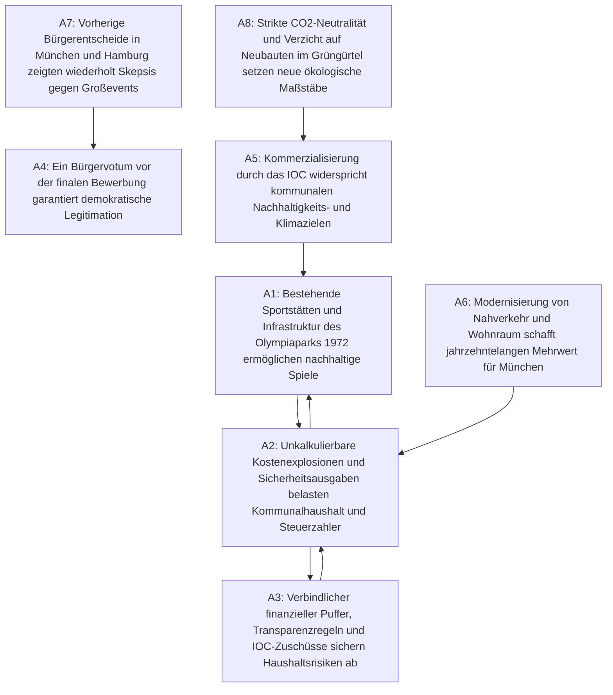

# Argumentationsanalyse: Deutsche Olympia-Bewerbung Münchens

*Erstellt am: 2026-09-27 16:45:00*

## Übersicht
- **Thema:** Deutsche Olympia-Bewerbung Münchens (Sommerspiele / Winterspiele)
- **Solver:** naive (PR - Preferred Semantics)
- **Extrahierte Argumente:** 9
- **Identifizierte Konflikte (Angriffe):** 8
- **Berechnete Perspektiven (Extensions):** 2
- **Erkannte Streitachsen:** 1

---

## Argumentationsgraph (Mermaid)

---

## Argumente & Strukturelle Klassifikation

- **A1**: *Bestehende Sportstätten und Infrastruktur des Olympiaparks 1972 ermöglichen nachhaltige Spiele*  
  *(Klasse: contested, Score: 0.50, In-Degree: 2, Out-Degree: 1)*
- **A2**: *Unkalkulierbare Kostenexplosionen und Sicherheitsausgaben belasten Kommunalhaushalt und Steuerzahler*  
  *(Klasse: contested, Score: 0.50, In-Degree: 2, Out-Degree: 2)*
- **A3**: *Verbindlicher finanzieller Puffer, Transparenzregeln und IOC-Zuschüsse sichern Haushaltsrisiken ab*  
  *(Klasse: contested, Score: 0.50, In-Degree: 1, Out-Degree: 1)*
- **A4**: *Ein Bürgervotum vor der finalen Bewerbung garantiert demokratische Legitimation*  
  *(Klasse: core, Score: 1.00, In-Degree: 1, Out-Degree: 0)*
- **A5**: *Kommerzialisierung durch das IOC widerspricht kommunalen Nachhaltigkeits- und Klimazielen*  
  *(Klasse: contested, Score: 0.50, In-Degree: 1, Out-Degree: 1)*
- **A6**: *Modernisierung von Nahverkehr und Wohnraum schafft jahrzehntelangen Mehrwert für München*  
  *(Klasse: core, Score: 1.00, In-Degree: 0, Out-Degree: 1)*
- **A7**: *Vorherige Bürgerentscheide in München und Hamburg zeigten wiederholt Skepsis gegen Großevents*  
  *(Klasse: contested, Score: 0.50, In-Degree: 0, Out-Degree: 1)*
- **A8**: *Strikte CO2-Neutralität und Verzicht auf Neubauten im Grüngürtel setzen neue ökologische Maßstäbe*  
  *(Klasse: core, Score: 1.00, In-Degree: 0, Out-Degree: 1)*

---

## Mathematisch berechnete Perspektiven & Synthese

### Perspektive 1: Nachhaltige Transformation & Sporteuphorie
**Zusammensetzung (Extension 1):** `{A1, A3, A4, A6, A8}`  
> **These:** München verfügt durch das historische Erbe von 1972 über einmalige Voraussetzungen für zukunftsfähige Spiele. Klare Finanzpuffer, Investitionen in den Nahverkehr und kompromisslose ökologische Kriterien machen die Bewerbung zu einem Jahrhundertprojekt für die Stadtgesellschaft.

### Perspektive 2: Fiskalische Haushaltsdisziplin & Bürger-Skepsis
**Zusammensetzung (Extension 2):** `{A2, A4, A5, A6, A7}`  
> **These:** Das unkalkulierbare Kostenrisiko von Mega-Events und die starren Knebelverträge des IOC sind mit solider Kommunalpolitik unvereinbar. Frühere Bürgerentscheide belegen, dass die Bevölkerung berechtigte Zweifel an den Nachhaltigkeitsversprechen hat.

---

## Erkannte Streitachse (Dilemma-Achse)
- **A1 ↔ A2**: *Fundamentaler Zielkonflikt zwischen visionärer Stadtentwicklung durch Sportgroßereignisse und dem strikten Schutz öffentlicher Finanzen vor Kostenfallen.*
