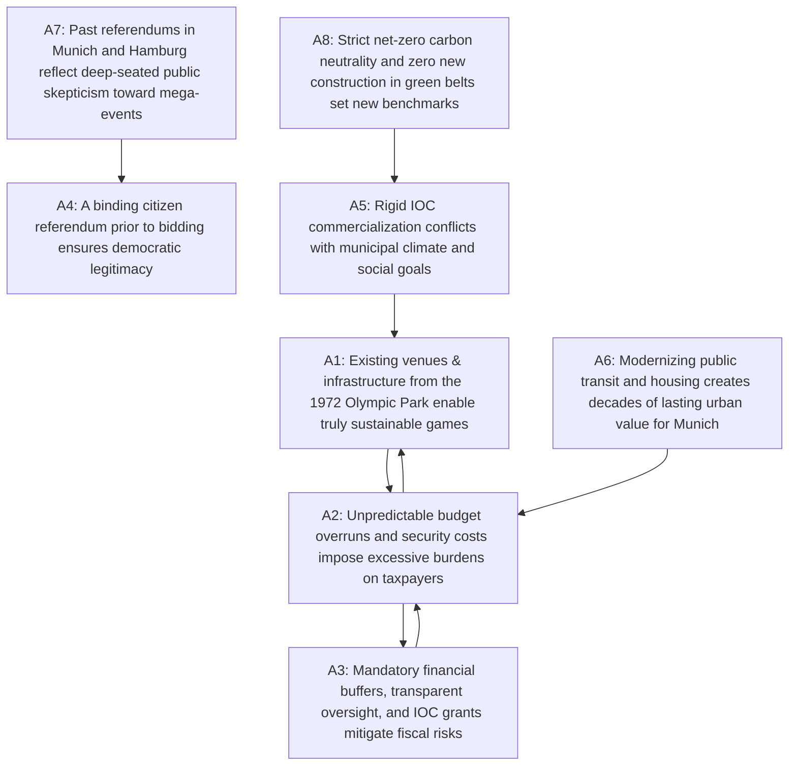

# Argumentation Analysis: German Olympic Bid for Munich

*Generated on: 2026-09-27 16:45:00*

## Summary
- **Topic:** Munich Olympic Bid (Summer / Winter Games)
- **Solver:** naive (PR - Preferred Semantics)
- **Extracted Arguments:** 8
- **Identified Conflicts (Attacks):** 8
- **Computed Perspectives (Extensions):** 2
- **Dilemma Axes:** 1

---

## Argumentation Graph (Mermaid)

---

## Arguments & Structural Classification

- **A1**: *Existing venues & infrastructure from the 1972 Olympic Park enable truly sustainable games*  
  *(Class: contested, Score: 0.50, In-Degree: 2, Out-Degree: 1)*
- **A2**: *Unpredictable budget overruns and security costs impose excessive burdens on taxpayers*  
  *(Class: contested, Score: 0.50, In-Degree: 2, Out-Degree: 2)*
- **A3**: *Mandatory financial buffers, transparent oversight, and IOC grants mitigate fiscal risks*  
  *(Class: contested, Score: 0.50, In-Degree: 1, Out-Degree: 1)*
- **A4**: *A binding citizen referendum prior to bidding ensures democratic legitimacy*  
  *(Class: core, Score: 1.00, In-Degree: 1, Out-Degree: 0)*
- **A5**: *Rigid IOC commercialization conflicts with municipal climate and social goals*  
  *(Class: contested, Score: 0.50, In-Degree: 1, Out-Degree: 1)*
- **A6**: *Modernizing public transit and housing creates decades of lasting urban value for Munich*  
  *(Class: core, Score: 1.00, In-Degree: 0, Out-Degree: 1)*
- **A7**: *Past referendums in Munich and Hamburg reflect deep-seated public skepticism toward mega-events*  
  *(Class: contested, Score: 0.50, In-Degree: 0, Out-Degree: 1)*
- **A8**: *Strict net-zero carbon neutrality and zero new construction in green belts set new benchmarks*  
  *(Class: core, Score: 1.00, In-Degree: 0, Out-Degree: 1)*

---

## Mathematical Perspectives & Synthesis

### Perspective 1: Sustainable Transformation & Civic Pride
**Composition (Extension 1):** `{A1, A3, A4, A6, A8}`  
> **Thesis:** Munich holds a unique advantage thanks to the surviving 1972 Olympic infrastructure. Transparent fiscal safeguards, transit investments, and rigorous ecological standards turn the bid into an inspiring generational opportunity.

### Perspective 2: Fiscal Discipline & Democratic Skepticism
**Composition (Extension 2):** `{A2, A4, A5, A6, A7}`  
> **Thesis:** The chronic risk of cost explosion inherent in mega-events and the IOC's commercial demands are incompatible with prudent municipal governance. Preceding civic referendums justify voter resistance to speculative promises.

---

## Detected Dilemma Axis
- **A1 ↔ A2**: *Irreconcilable trade-off between transformative urban legacy through major sports events versus safeguarding municipal public funds against speculative budget deficits.*
