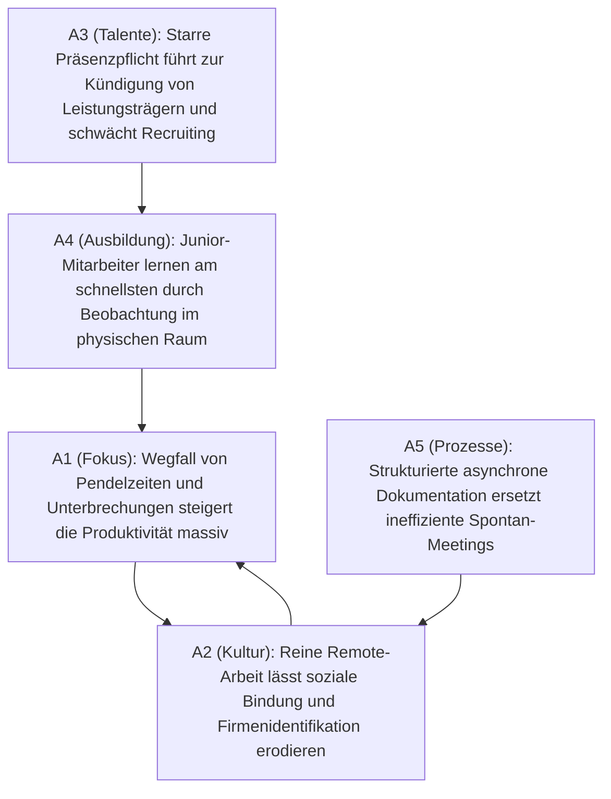

# Showcase: Streitfrage „Homeoffice vs. Präsenzpflicht (Return-to-Office)“

**Status:** Mathematisch analysiert via `clashpy`  
**Thema:** Debatte um Remote Work, Hybridmodelle und Büroanwesenheit  
**Methode:** Neuro-symbolische KI (LLM-Parsing via Pydantic-AI + Dung Preferred Semantics Solver)

---

## 1. Übersicht

Die Diskussion über die Rückkehr ins Büro (Return-to-Office / RTO) wird oft emotional geführt. 
`clashpy` nimmt die Argumente aus Fachartikeln und Umfragen auf, bildet die wechselseitigen Angriffe ab und rechnet objektiv aus, welche Denkschulen in sich logisch konsistent sind.

---

## 2. Der visualisierte Konflikt-Graph (Mermaid)

---

## 3. Die berechneten Denkschulen (Preferred Extensions)

Der mathematische Dung-Solver ermittelt aus den Wechselwirkungen genau **zwei stabile, in sich geschlossene Perspektiven**:

### Perspektive 1: „Autonomie & Output-Orientierung“
- **Kombination:** `{A1, A3, A5}`
- **Zusammenfassung:**  
  *Vertrauen, asynchrone Arbeitsweisen und Flexibilität binden Top-Fachkräfte. Das Argument des Kulturverlusts wird durch klare digitale Dokumentation und bewusste Remote-Prozesse entkräftet.*

### Perspektive 2: „Kultur & Präsenzfokus“
- **Kombination:** `{A2, A4}`
- **Zusammenfassung:**  
  *Unternehmen sind mehr als Aufgabenerledigung. Physische Nähe ist für informellen Wissensaustausch, Teambindung und die Sozialisation von Nachwuchskräften unverzichtbar.*

---

## 4. Erkannte Streitachse (Dilemma-Achse)

- **A1 ↔ A2 (Individuelle Produktivität vs. Soziales Teamgefüge):**  
  *Der Kernkonflikt: Kann eine rein digitale Organisation auf Dauer die gleiche Bindungskraft und Unternehmenskultur halten wie ein Team mit physischer Begegnung?*
