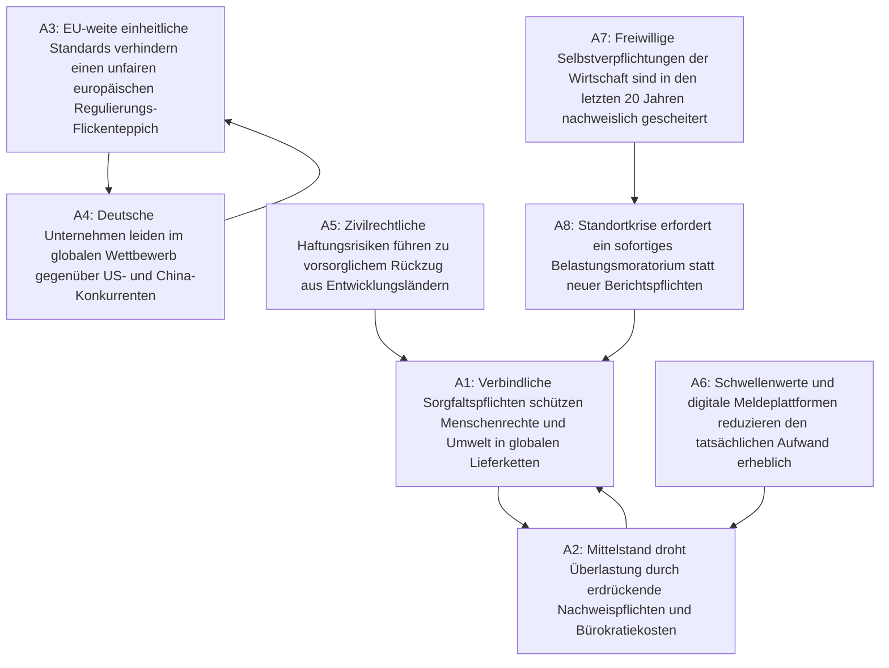

# clashpy Showcase: Streitfrage „EU-Lieferkettengesetz & Bürokratie-Entlastung“

**Status:** Mathematisch analysiert via `clashpy`  
**Datum:** 2026-09-27  
**Semantik:** Dung Preferred Semantics (PR)  
**Methode:** Neuro-symbolische KI (LLM-Parsing via Pydantic-AI + deterministischer Graph-Solver)

---

## 1. Executive Summary

Die Debatte um das **EU-Lieferkettengesetz (CSDDD)** und geplante Bürokratie-Erleichterungen spaltet Wirtschaft, Politik und Zivilgesellschaft. 

Klassische KI-Modelle geben bei solchen Fragestellungen meist vage Zusammenfassungen aus, die von Zufall oder Voreingenommenheit geprägt sind. **`clashpy`** extrahiert stattdessen die harten Kernaussagen und Angriffsvektoren und berechnet formallogisch zwei unvereinbare, in sich konsistente Denkschulen:

1. **Denkschule 1 (Verantwortung & Globale Standards):** Menschenrechte und Klimaschutz sind nicht verhandelbar; Rechtssicherheit schützt vor unfairem Dumpingwettbewerb.
2. **Denkschule 2 (Wettbewerbsfähigkeit & Entlastung):** Überbordende Dokumentationspflichten und Haftungsrisiken gefährden den Mittelstand und strangulieren den Industriestandort Europa.

---

## 2. Der visualisierte Konflikt-Graph (Mermaid)

---

## 3. Topologische Metriken & Akzeptanz-Scores

| Argument | Kernaussage | Score | Status | In-Degree | Out-Degree |
| :--- | :--- | :--- | :--- | :--- | :--- |
| **A1** | Schutz von Menschenrechten & Umwelt | **0.50** | *contested* | 3 | 1 |
| **A2** | Überlastung des Mittelstands durch Bürokratie | **0.50** | *contested* | 2 | 1 |
| **A3** | Einheitliche EU-Standards gegen Flickenteppich | **0.50** | *contested* | 1 | 1 |
| **A4** | Wettbewerbsnachteil ggü. USA und China | **0.50** | *contested* | 1 | 1 |
| **A5** | Haftungsrisiken erzwingen De-Risking aus Entwicklungsländern | **0.50** | *contested* | 0 | 1 |
| **A6** | Schwellenwerte & Digitalisierung dämpfen Aufwand | **1.00** | **core** | 0 | 1 |
| **A7** | Historisches Scheitern freiwilliger Selbstverpflichtungen | **1.00** | **core** | 0 | 1 |
| **A8** | Belastungsmoratorium für Standort-Wettbewerbsfähigkeit | **0.50** | *contested* | 1 | 1 |

### Erkannter Basis-Konsens (`core`, Score = 1.00):
- **A6** (Praktische Entlastung durch Digitalisierung/Schwellenwerte) und **A7** (Unzureichende Wirkung reiner Freiwilligkeit) überleben in **beiden** Denkschulen. Sie bilden die gemeinsame argumentative Basis für politische Kompromisse.

---

## 4. Berechnete Perspektiven (Extensions)

### Perspektive A: „Globale Verantwortung & Marktintegrität“
*Zusammensetzung:* `{A1, A3, A6, A7}`  
> **These:** Nachhaltigkeit und Menschenrechte erfordern verbindliche Spielregeln. Klare europäische Standards schaffen fairen Wettbewerb und schützen vor regulatorischer Willkür, während digitale Meldeverfahren administrative Belastungen für Unternehmen minimieren.

### Perspektive B: „Standortsicherung & Entlastung“
*Zusammensetzung:* `{A2, A4, A5, A6, A7, A8}`  
> **These:** Angesichts von Rezession und scharfem internationalen Wettbewerb (USA/China) wiegen Haftungsrisiken und Bürokratieaufwand schwerer als ethische Absichten. Ohne ein sofortiges Regulierungsmoratorium drohen De-Investitionen und Wohlstandsverluste.

---

## 5. Fundamentale Streitachse (Dilemma-Achse)

- **A1 ↔ A2 (Schutzstandards vs. Mittelstandsüberlastung):**  
  *Unüberbrückbarer Zielkonflikt: Kann die Einhaltung globaler Werte gesetzlich erzwungen werden, ohne die wirtschaftliche Existenz europäischer Zulieferer zu gefährden?*
