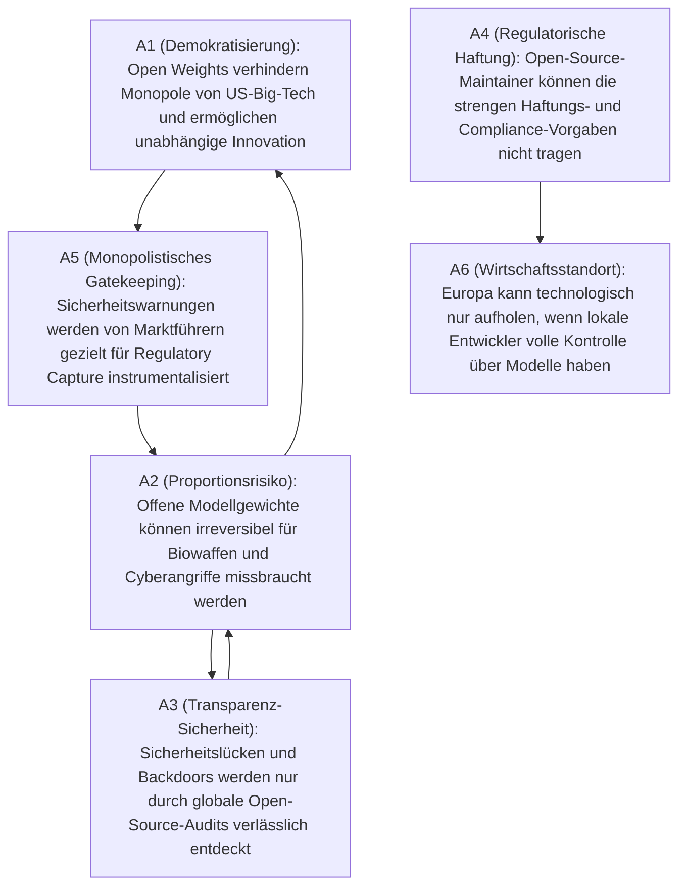

# Showcase: Streitfrage „Open-Source AI (Open Weights) vs. Closed-Source (SaaS Gatekeeping)“

**Status:** Mathematisch analysiert via `clashpy`  
**Thema:** Debatte um Modelloffenheit, KI-Monopole, Missbrauchsrisiken und Haftung  
**Methode:** Neuro-symbolische KI (LLM-Parsing via Pydantic-AI + Dung Preferred Semantics Solver)

---

## 1. Executive Summary

Die Frage, ob hochleistungsfähige KI-Basismodelle (Frontier Models) quelloffen als **Open Weights** (wie Metas Llama oder Mistral) bereitgestellt oder strikt hinter proprietären APIs (wie OpenAI GPT-4 oder Google Gemini) abgeschirmt werden sollten, ist eine der folgenreichsten Debatten der modernen Technologiepolitik.

Klassische Zusammenfassungen stellen dies oft als simples „Freiheit vs. Sicherheit“ dar. Die formale Graph-Analyse von `clashpy` deckt auf, dass sich die Argumente **über Bande gegenseitig aushebeln** (z. B. Verteidigung von $A1$ gegen $A2$ durch $A3$).

---

## 2. Der visualisierte Konflikt-Graph (Mermaid)

---

## 3. Topologische Metriken & Akzeptanz-Scores

| Argument | Kernaussage | Score | Status | In-Degree | Out-Degree |
| :--- | :--- | :--- | :--- | :--- | :--- |
| **A1** | Demokratisierung gegen Big-Tech-Monopole | **0.50** | *contested* | 1 | 1 |
| **A2** | Irreversibles Proliferations- & Missbrauchsrisiko | **0.50** | *contested* | 2 | 2 |
| **A3** | Sicherheit durch globale Transparenz (Linus' Law) | **0.50** | *contested* | 1 | 1 |
| **A4** | Überlastung von Open-Source durch Haftungsauflagen | **1.00** | **core** | 0 | 1 |
| **A5** | Regulatory Capture: Sicherheit als Hebel gegen Wettbewerb | **0.50** | *contested* | 1 | 1 |
| **A6** | Standort-Autonomie durch modifizierbare Gewichte | **0.50** | *contested* | 1 | 0 |

---

## 4. Berechnete Denkschulen (Preferred Extensions)

Der Dung-Solver ermittelt aus den Wechselwirkungen genau **zwei stabile, in sich geschlossene Perspektiven**:

### Perspektive 1: „Souveränität, Transparenz & Wettbewerb“
- **Kombination:** `{A1, A3, A4, A5}`
- **Zusammenfassung:**  
  *Open-Source-KI ist unverzichtbar gegen digitale Abhängigkeiten. Das Missbrauchsrisiko ($A2$) wird durch globale Transparenz ($A3$) und die Entlarvung protektionistischer Regulierung ($A5$) entkräftet. Dennoch bleibt die Haftungsbürde ($A4$) eine ungelöste Herausforderung.*

### Perspektive 2: „Sicherheitsimperativ & Gefahrenabwehr“
- **Kombination:** `{A2, A4}`
- **Zusammenfassung:**  
  *Da einmal veröffentlichte Gewichte nicht zurückgerufen oder gepatcht werden können, überwiegt das Risiko existenzieller Fehlanwendungen jeden Innovationsnutzen. Haftungsregeln ($A4$) und Missbrauchspotenziale ($A2$) erzwingen kontrollierte API-Gatekeeper.*

---

## 5. Fundamentale Streitachse (Dilemma-Achse)

- **A2 ↔ A3 (Missbrauchsgefahr vs. Transparenzgewinn):**  
  *Unlösbare Grundsatzfrage: Führt das Verstecken von Modellgewichten zu mehr Sicherheit vor Kriminellen (Security through Obscurity) – oder schafft erst die offene Offenlegung die notwendige globale Abwehrkraft?*
