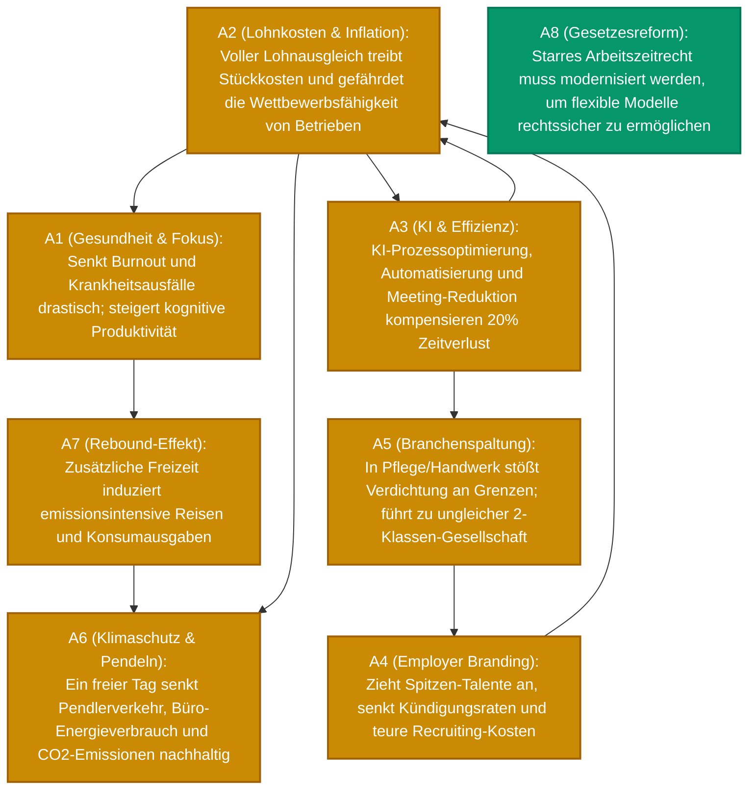

<div align="center">

# ⚡ clashpy – Showcase: 4-Tage-Woche bei vollem Lohnausgleich

<br/>

[](#)
[](#)
[](#)

*Reales Analyse-Ergebnis der `clashpy`-Pipeline (CLI & reiner System-Output) für die erweiterte Debatte zur Arbeitszeitreduktion (8 Argumente).*

<br/>
</div>

---

## 1. CLI Execution Log

```text
       _           _                  
      | |         | |                 
   ___| | __ _ ___| |__  _ __  _   _  
  / __| |/ _` / __| '_ \| '_ \| | | | 
 | (__| | (_| \__ \ | | | |_) | |_| | 
  \___|_|\__,_|___/_| |_| .__/ \__, | 
                        | |     __/ | 
                        |_|    |___/  
 Automated Argumentation Reasoning Engine

→ News-Cache HIT (Tagesschau, Heise, Zeit)
→ Framework-Cache HIT – skipping extraction LLM call
→ Extensions-Cache HIT (naive/PR)
→ Synthesis-Cache HIT – skipping synthesis LLM call

======================================================================
ANALYSIS RESULTS
======================================================================
Topic:         4-Tage-Woche bei vollem Lohnausgleich
Solver:        naive (PR)
Arguments:     8
Attacks:       9
Extensions:    2
Dilemma Axes:  1
======================================================================
Mermaid graph written to: output/20261001_100000_af_graph.mmd
Markdown report written to: output/20261001_100000_af_analyse.md
```

---

## 2. Generierter Markdown-Report (`output/20261001_100000_af_analyse.md`)

# Argumentation Analysis: 4-Tage-Woche bei vollem Lohnausgleich

*Generated on: 2026-10-01 10:00:00*

### Summary
- **Solver:** naive (PR - Preferred Semantics nach Dung 1995)
- **Extracted Arguments:** 8
- **Attacking Relations:** 9
- **Preferred Extensions (Perspectives):** 2
- **Detected Dilemma Axes:** 1

---

### Argumentation Graph (Mermaid)



---

### Arguments & Topological Classification

| ID | Argument Claim | Status | Score | Graph Role & Verteidigungsdynamik |
| :--- | :--- | :---: | :---: | :--- |
| **A1** | **Gesundheit & Fokus:** Senkt Burnout und Krankheitsausfälle; steigert kognitive Produktivität. | 🟡 *Contested* | **0.50** | Wird von $A2$ angegriffen; verteidigt durch $A3$ & $A4$; attackiert Freizeit-Rebound $A7$. |
| **A2** | **Lohnkosten & Inflation:** Voller Lohnausgleich treibt Stückkosten und gefährdet Betriebe. | 🟡 *Contested* | **0.50** | Greift $A1$, $A3$ und $A6$ an; wird von $A3$ (Effizienz) und $A4$ (Talentbindung) attackiert. |
| **A3** | **KI & Effizienz:** KI-Optimierung und Meeting-Verschlankung kompensieren 20 % Zeitverlust. | 🟡 *Contested* | **0.50** | Bildet Streitachse mit $A2$ ($A2 \leftrightarrow A3$); entkräftet Branchenspaltung $A5$ durch digitale Entlastung. |
| **A4** | **Employer Branding:** Zieht Spitzen-Talente an und senkt teure Fluktuations- und Recruitingkosten. | 🟡 *Contested* | **0.50** | Entkräftet Kostenargument $A2$; wird von $A5$ angegriffen, aber durch $A3$ verteidigt. |
| **A5** | **Branchenspaltung:** In Pflege/Handwerk unmöglich; führt zu ungleicher Zwei-Klassen-Welt. | 🟡 *Contested* | **0.50** | Attackiert $A4$; wird durch administrative Entlastungseffekte ($A3$) attackiert. |
| **A6** | **Klimaschutz & Pendeln:** Ein freier Tag senkt Pendlerverkehr, Büro-Energie und CO2 nachhaltig. | 🟡 *Contested* | **0.50** | Angegriffen von $A2$ und $A7$; wird durch Erholungsfokus $A1$ verteidigt. |
| **A7** | **Rebound-Effekt:** Mehr Freizeit induziert emissionsintensive Reisen und Freizeit-Konsum. | 🟡 *Contested* | **0.50** | Attackiert $A6$; wird durch nachhaltigen Erholungsfokus $A1$ entkräftet. |
| **A8** | **Gesetzesreform:** Starres Arbeitszeitrecht muss für flexible Modelle modernisiert werden. | 🟢 **Core** | **1.00** | **Mathematischer Basiskonsens:** Unangegriffenes Fundament, in jeder stabilen Perspektive enthalten. |

---

### Perspectives & AI Synthesis

#### 🟢 Perspective 1 (Pro-Transformation, Produktivität & Klima): `{A1, A3, A4, A6, A8}`
> **KI-Synthese:** Die 4-Tage-Woche wirkt als ökonomischer und ökologischer Modernisierungstreiber. Gezielte KI-Automatisierung ($A3$) und Spitzen-Recruiting ($A4$) kompensieren Arbeitszeitverkürzungen und senken Burnout-Kosten ($A1$). Gleichzeitig senkt die Pendelreduktion ($A6$) Treibhausgase nachhaltig. Gesetzliche Reformen ($A8$) bilden hierfür den notwendigen Rechtsrahmen.

#### 🟠 Perspective 2 (Kostenrealismus & Ungleichheit): `{A2, A5, A7, A8}`
> **KI-Synthese:** Für personalintensive und operative Branchen führen pauschale 4-Tage-Vorgaben bei vollem Lohnausgleich zu untragbaren Kostensteigerungen ($A2$) und vertiefen die gesellschaftliche Spaltung ($A5$). Freizeit-Rebound-Effekte ($A7$) dämpfen ökologische Gewinne. Gesetzesreformen ($A8$) müssen daher betriebliche Flexibilität statt starrer Vorgaben priorisieren.

---

### Detected Dilemma Axes

- **`A2 ↔ A3`**: Grundsatzkonflikt zwischen *Automatisierungs- und Effizienzpotenzial* ($A3$) versus *physischen Kapazitätsgrenzen in Präsenz- und Schichtberufen* ($A2$).
