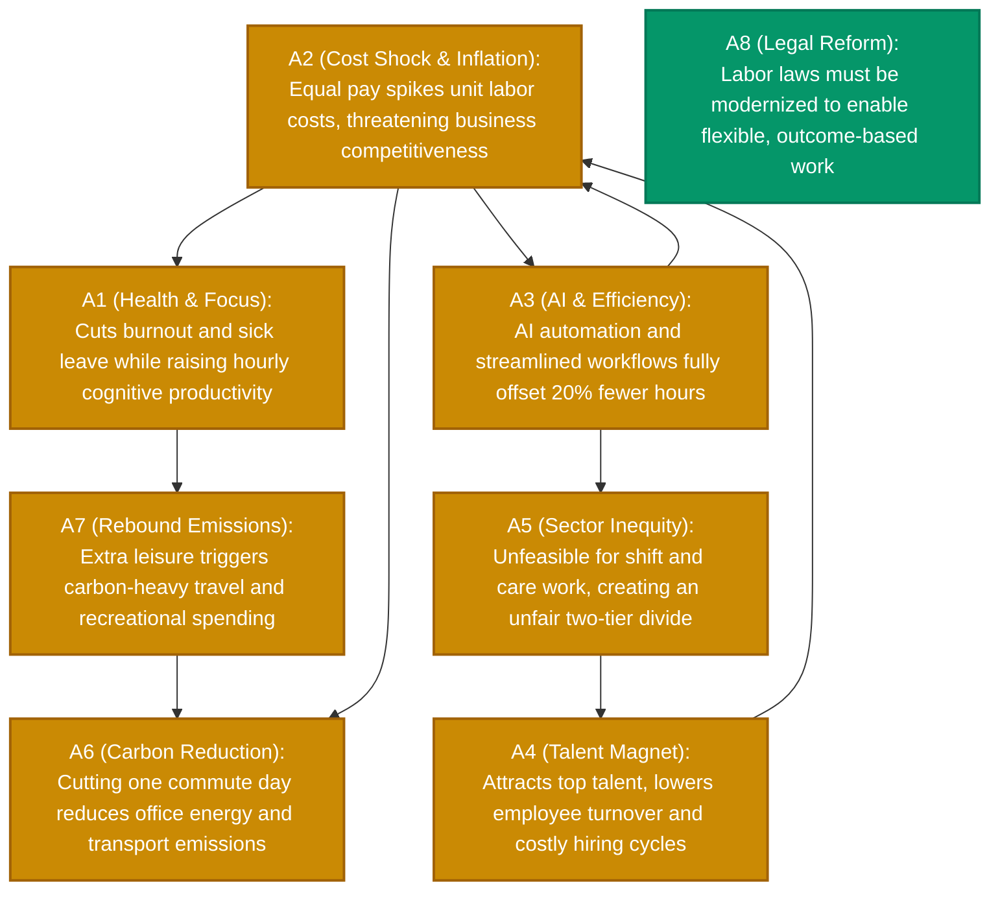

<div align="center">

# ⚡ clashpy – Showcase: 4-Day Work Week (100% Pay, 80% Time)

<br/>

[](#)
[](#)
[](#)

*Real-world analysis pipeline execution (CLI & pure system output) for the expanded 8-argument work-week reform debate.*

<br/>
</div>

---

## 1. CLI Execution Log

```text
       _           _                  
      | |         | |                 
   ___| | __ _ ___| |__  _ __  _   _  
  / __| |/ _` / __| '_ \| '_ \| | | | 
 | (__| | (_| \__ \ | | | |_) | |_| | 
  \___|_|\__,_|___/_| |_| .__/ \__, | 
                        | |     __/ | 
                        |_|    |___/  
 Automated Argumentation Reasoning Engine

→ News-Cache HIT (Tagesschau, Heise, Zeit)
→ Framework-Cache HIT – skipping extraction LLM call
→ Extensions-Cache HIT (naive/PR)
→ Synthesis-Cache HIT – skipping synthesis LLM call

======================================================================
ANALYSIS RESULTS
======================================================================
Topic:         4-Day Work Week (Equal Pay)
Solver:        naive (PR)
Arguments:     8
Attacks:       9
Extensions:    2
Dilemma Axes:  1
======================================================================
Mermaid graph written to: output/20261001_100000_af_graph.mmd
Markdown report written to: output/20261001_100000_af_analyse.md
```

---

## 2. Generated Markdown Report (`output/20261001_100000_af_analyse.md`)

# Argumentation Analysis: 4-Day Work Week (Equal Pay)

*Generated on: 2026-10-01 10:00:00*

### Summary
- **Solver:** naive (PR - Preferred Semantics according to Dung 1995)
- **Extracted Arguments:** 8
- **Attacking Relations:** 9
- **Preferred Extensions (Perspectives):** 2
- **Detected Dilemma Axes:** 1

---

### Argumentation Graph (Mermaid)



---

### Arguments & Topological Classification

| ID | Argument Claim | Status | Score | Graph Role & Defense Dynamic |
| :--- | :--- | :---: | :---: | :--- |
| **A1** | **Health & Focus:** Reduces burnout and sick days while raising hourly productivity. | 🟡 *Contested* | **0.50** | Attacked by $A2$; defended by $A3$ & $A4$; neutralizes leisure rebound $A7$. |
| **A2** | **Cost Shock & Inflation:** Equal pay spikes unit labor costs and hurts viability. | 🟡 *Contested* | **0.50** | Attacks $A1$, $A3$, $A6$; attacked by $A3$ (Efficiency) and $A4$ (Retention). |
| **A3** | **AI & Efficiency:** Automation and meeting reduction offset 20% fewer hours. | 🟡 *Contested* | **0.50** | Symmetric dilemma axis with $A2$ ($A2 \leftrightarrow A3$); mitigates sector inequity $A5$. |
| **A4** | **Talent Magnet:** Attracts top talent and cuts turnover and recruiting overhead. | 🟡 *Contested* | **0.50** | Counterattacks $A2$; attacked by $A5$, defended by $A3$. |
| **A5** | **Sector Inequity:** Unfeasible for shift/care work, creating a two-tier labor market. | 🟡 *Contested* | **0.50** | Attacks $A4$; contested by digital administrative relief from $A3$. |
| **A6** | **Carbon Reduction:** Cutting one commute day reduces transport emissions. | 🟡 *Contested* | **0.50** | Attacked by $A2$ and $A7$; defended by health/sustainable leisure focus $A1$. |
| **A7** | **Rebound Emissions:** Extra leisure triggers carbon-heavy travel and consumption. | 🟡 *Contested* | **0.50** | Attacks $A6$; counterattacked by rest-oriented lifestyle $A1$. |
| **A8** | **Legal Reform:** Labor laws must be modernized for flexible working models. | 🟢 **Core** | **1.00** | **Mathematical Consensus:** Unattacked foundation, accepted across all stable extensions. |

---

### Perspectives & AI Synthesis

#### 🟢 Perspective 1 (Pro-Transformation, Productivity & Climate): `{A1, A3, A4, A6, A8}`
> **AI Synthesis:** The 4-day work week acts as an economic and ecological modernization catalyst. Target AI automation ($A3$) and superior talent retention ($A4$) offset reduced hours and eliminate burnout costs ($A1$), while commute reduction ($A6$) lowers emissions under modernized labor laws ($A8$).

#### 🟠 Perspective 2 (Cost Realism & Inequity): `{A2, A5, A7, A8}`
> **AI Synthesis:** For labor-intensive frontline sectors, blanket 4-day mandates trigger unsustainable cost spikes ($A2$) and systemic labor inequality ($A5$). Leisure rebound effects ($A7$) erode ecological gains. Legal reforms ($A8$) must prioritize sectoral flexibility over universal wage compensation mandates.

---

### Detected Dilemma Axes

- **`A2 ↔ A3`**: Fundamental tradeoff between *Automation & Productivity Offset Potential* ($A3$) versus *Physical Operational Capacity Limits in Frontline Shift Work* ($A2$).
