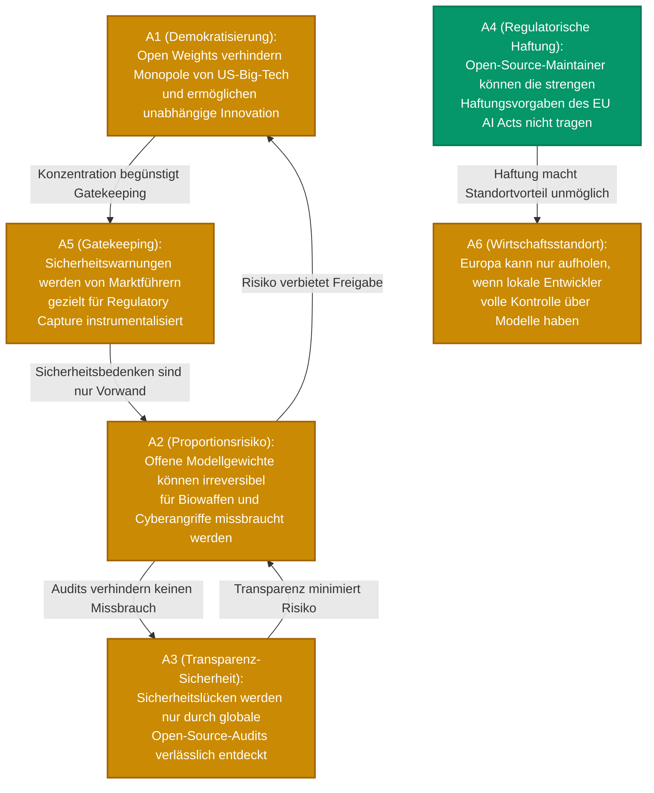

# ⚡ clashpy – Showcase: Open-Source AI (Open Weights) vs. Closed-Source

 

*Ein reales Anwendungsbeispiel der `clashpy`-Pipeline zur Identifikation von blinden Flecken und Zielkonflikten in komplexen Technologie-Debatten.*

 

---

## 1. Executive Summary

Die Frage, ob hochleistungsfähige KI-Basismodelle (Frontier Models) quelloffen als **Open Weights** (wie Llama oder Mistral) bereitgestellt oder strikt hinter proprietären APIs (wie GPT-4) abgeschirmt werden sollten, prägt die aktuelle Technologiepolitik.

Klassische KI-Modelle geben bei der Zusammenfassung solcher Diskurse oft nur ein narratives "Freiheit vs. Sicherheit" aus. Die formale Graph-Analyse von **`clashpy`** deckt jedoch auf, wie sich Argumente über Bande gegenseitig aushebeln und welche Kernaspekte einen mathematisch unbestreitbaren Konsens bilden.

---

## 2. Der visualisierte Konflikt-Graph (Mermaid)

Das Pydantic-AI Extraktions-Modell übersetzt die Debatte in einen formalen, gerichteten Dung-Graphen $AF = (A, R)$.

> **Legende:**  
> 🟡 = Umstritten (Contested) | 🟢 = Basis-Konsens (Core)

---

## 3. Berechnete Denkschulen (Preferred Extensions)

Der deterministische Solver ermittelt aus dem Graphen exakt **zwei stabile, konfliktfreie Perspektiven**:

<b>🟢 Perspektive 1: Souveränität, Transparenz & Wettbewerb</b>

 

- **Zusammensetzung:** `{A1, A3, A4, A5}`
- **KI-Synthese:** Open-Source-KI ist unverzichtbar gegen digitale Abhängigkeiten. Das Missbrauchsrisiko ($A2$) wird durch globale Transparenz ($A3$) und die Entlarvung protektionistischer Regulierung ($A5$) entkräftet. Dennoch bleibt die Haftungsbürde ($A4$) für Maintainer eine ungelöste Herausforderung.

<b>🟠 Perspektive 2: Sicherheitsimperativ & Gefahrenabwehr</b>

 

- **Zusammensetzung:** `{A2, A4}`
- **KI-Synthese:** Da veröffentlichte Modellgewichte nicht zurückgerufen oder gepatcht werden können, überwiegt das Risiko existenzieller Fehlanwendungen jeden Innovationsnutzen. Strenge Haftungsregeln ($A4$) und Missbrauchspotenziale ($A2$) erzwingen abgeschirmte API-Gatekeeper.

---

## 4. Topologische Metriken & Erkenntnisse

Das System berechnet rein mathematische Scores (Auftreten in Extensions / Akzeptanz). 

| Argument | Score | Klassifikation | Topologischer Befund |
| :--- | :---: | :--- | :--- |
| **A4 (Haftungslast)** | **1.00** | 🟢 **Core** | Überlebt in allen Perspektiven. Die Haftungsfrage für Open-Source-Entwickler ist der eigentliche mathematische *Blind Spot*, der von keiner Fraktion logisch entkräftet werden kann. |
| **A1 (Demokratisierung)** | **0.50** | 🟡 *Contested* | Hochgradig abhängig von der Neutralisierung des Missbrauchsrisikos ($A2$). |
| **A2 (Missbrauch)** | **0.50** | 🟡 *Contested* | Wird zangenförmig attackiert ($A3$ & $A5$), wehrt sich aber durch direkten Gegenangriff gegen die Transparenz-These. |

### ⚡ Die Fundamentale Streitachse (Dilemma-Achse)

Das Tool identifiziert **`A2 ↔ A3`** als unüberbrückbare Achse:
> *Führt das Verstecken von Modellgewichten zu mehr Sicherheit vor Kriminellen (Security through Obscurity) – oder schafft erst die radikale Offenlegung die notwendige globale Abwehrkraft?*
