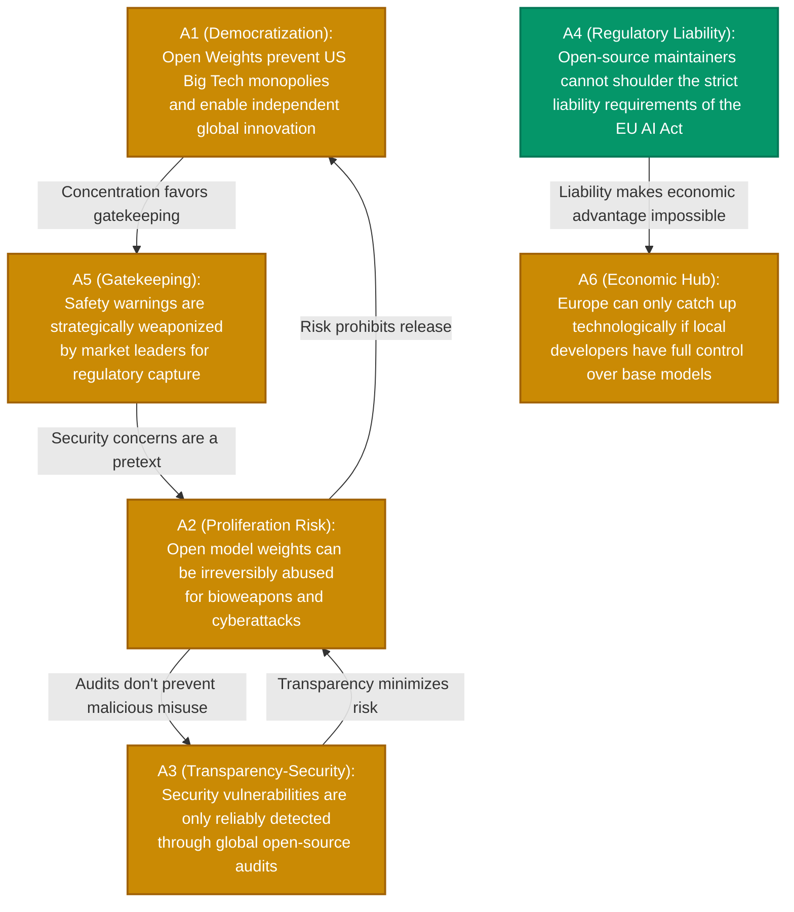

# ⚡ clashpy – Showcase: Open-Source AI (Open Weights) vs. Closed-Source

 

*A real-world application of the `clashpy` pipeline to identify blind spots and fundamental dilemmas in complex technology debates.*

 

---

## 1. Executive Summary

The question of whether frontier AI models should be released openly as **Open Weights** (like Llama or Mistral) or shielded strictly behind proprietary APIs (like GPT-4) is one of the most consequential debates in modern tech policy.

Traditional AI models often reduce such discourses to a simple "freedom vs. security" narrative. The formal graph analysis provided by **`clashpy`**, however, reveals how arguments leverage one another (e.g., $A3$ defending $A1$ against $A2$) and isolates the core aspects that form an undeniable mathematical consensus.

---

## 2. Visualized Conflict Graph (Mermaid)

The Pydantic-AI extraction model translates the debate into a formal, directed Dung graph $AF = (A, R)$.

> **Legend:**  
> 🟡 = Contested | 🟢 = Core Consensus

---

## 3. Computed Perspectives (Preferred Extensions)

The deterministic solver computes exactly **two stable, conflict-free perspectives** from the graph:

<b>🟢 Perspective 1: Sovereignty, Transparency & Competition</b>

 

- **Composition:** `{A1, A3, A4, A5}`
- **AI Synthesis:** Open-source AI is essential to combat digital dependency. The proliferation risk ($A2$) is neutralized by global transparency ($A3$) and by exposing protectionist regulatory capture ($A5$). However, the liability burden ($A4$) for maintainers remains an unresolved challenge.

<b>🟠 Perspective 2: Security Imperative & Risk Mitigation</b>

 

- **Composition:** `{A2, A4}`
- **AI Synthesis:** Because published model weights cannot be recalled or patched, the risk of existential misuse outweighs any innovation benefits. Strict liability rules ($A4$) and abuse potentials ($A2$) mandate shielded API gatekeepers.

---

## 4. Topological Metrics & Insights

The system computes purely mathematical scores based on survival rates across extensions.

| Argument | Score | Classification | Topological Finding |
| :--- | :---: | :--- | :--- |
| **A4 (Liability)** | **1.00** | 🟢 **Core** | Survives in all perspectives. The liability issue for open-source developers is the mathematical *blind spot*, remaining logically undefeated by any faction. |
| **A1 (Democratization)** | **0.50** | 🟡 *Contested* | Highly dependent on the successful neutralization of the proliferation risk ($A2$). |
| **A2 (Misuse)** | **0.50** | 🟡 *Contested* | Attacked from two sides ($A3$ & $A5$) but fiercely defends itself via a direct counterattack against the transparency thesis. |

### ⚡ The Fundamental Dilemma Axis

The tool identifies **`A2 ↔ A3`** as an irreconcilable axis:
> *Does hiding model weights lead to greater security from malicious actors (Security through Obscurity) – or does radical openness create the very transparency required for global defense?*
