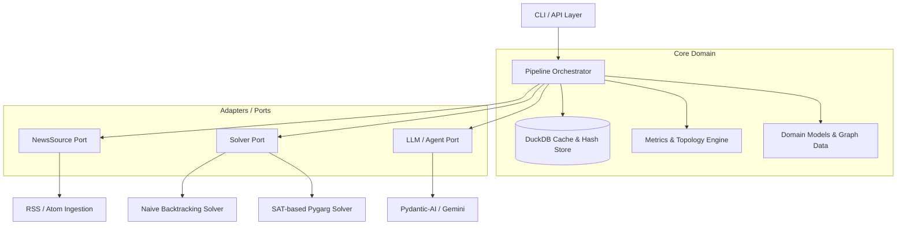

# Technical Specification: Automated Argumentation Reasoning Engine (`clashpy`)

## 1. System Overview & Objectives

**`clashpy`** is an automated pipeline and CLI tool designed to extract, formalize, evaluate, and synthesize argumentation structures from heterogeneous textual and news sources.
It bridges modern Large Language Models (LLM) with formal mathematical artificial intelligence (**Dung's Abstract Argumentation Frameworks**) to discover underlying conflicts, defensible perspectives (extensions), topological metrics, and synthesis theses.

### Core Architectural Principles
- **Hexagonal Architecture (Ports & Adapters)**: Clear decoupling between domain core logic, data ingestion sources, formal solvers, and LLM orchestration.
- **Open/Closed Principle**: New solvers (e.g. SAT, ASP) or ingestion sources can be added without modifying the core pipeline orchestrator.
- **Determinism & Cost Control**: Complete SHA-256 payload caching via an embedded analytical database (DuckDB).
- **Portability & CLI-first**: Seamless execution via standalone CLI, script, or library imports.

### Mandatory Technology Constraints
To ensure deterministic execution, maintainability, and clean reproducibility:
1. **Package & Environment Management (`uv`)**:
   - `uv` is the mandatory tool for virtualenvs, dependency locking, and execution.
   - Standard PEP 517/621 `pyproject.toml` with `hatchling` as build backend.
   - No legacy `requirements.txt` or proprietary `poetry.lock` formats.
2. **Schema Validation & Type Safety (`pydantic >= 2.x`)**:
   - All domain models must be implemented as strict Pydantic `BaseModel` classes.
   - Enforce typed structured outputs from LLMs via `pydantic-ai`.
3. **Analytical Cache (`duckdb`)**:
   - DuckDB provides local caching to eliminate latency and reduce LLM expenses.

---

## 2. Anti-Patterns & Negative Constraints (What NOT to Do)

1. **No Monolithic Scripting**:
   - Do not merge solver algorithms, news ingestion, caching, and reporting into a single large script.
2. **No Module-Level Eager Agent Instantiation**:
   - LLM agents must **never** be instantiated at module import time (prevents crashes when API keys are resolved later from keyrings or `.env`).
   - Agents must always be instantiated lazily via factory functions.
3. **No Heavyweight Orchestration Frameworks**:
   - Do not import LangChain, LlamaIndex, or AutoGen. `pydantic-ai` provides sufficient structured orchestration with minimal overhead.
4. **No Legacy Dependency Managers**:
   - Do not introduce `pipenv`, `poetry`, or raw `requirements.txt`.
5. **No Hallucinated Source URLs in Prompts**:
   - System prompts must strictly forbid URL extrapolation. If no direct link exists, output `"KEINE_QUELLE"`.
6. **No Hardcoded Secrets**:
   - API keys must never be committed to Git. Resolution order: `os.environ` → `.env` → OS Keyring.
7. **No Uncached LLM Invocations**:
   - Every extraction and synthesis LLM call must be preceded by a DuckDB cache check.
8. **No In-Place Mutations in Core Solvers**:
   - Functions in `core/solver.py` and `core/metrics.py` must remain pure functions without mutating input data.

---

## 3. Architecture & Component Model



### 3.1 Directory Structure
```
clashpy/
├── pyproject.toml
├── spec/
│   └── system_specification.md
├── docs/
│   ├── poster_en.pdf
│   ├── poster_en.png
│   └── poster_en.html
├── tests/
│   └── test_core.py
└── src/
    └── clashpy/
        ├── core/
        │   ├── models.py       # Pydantic domain models (Argument, Attack, AF)
        │   ├── hashing.py      # Deterministic key generation & secret resolution
        │   ├── cache.py        # Generic DuckDB cache interface
        │   ├── solver.py       # Abstract solver protocol & naive backtracking
        │   └── metrics.py      # Acceptance scores, degrees, dilemma axes
        ├── adapters/
        │   ├── news_sources/   # Ingestion adapters (RSS)
        │   └── solvers/        # External solver adapters (Pygarg SAT)
        ├── llm/
        │   └── agents.py       # Lazy LLM agent definitions (Pydantic-AI)
        ├── pipeline.py         # End-to-end workflow orchestration
        ├── cli.py              # Command-line interface
        └── doc_generator.py    # Automated doc & visual poster generator
```

---

## 4. Mathematical Foundations & Domain Models

### 4.1 Dung's Abstract Argumentation (1995)
An Argumentation Framework is a pair $AF = (A, R)$:
- $A$ is a finite set of arguments.
- $R \subseteq A \times A$ is a binary attack relation ($(a, b) \in R$ denotes $a$ attacks $b$).

### 4.2 Domain Models (`core/models.py`)

```python
class Argument(BaseModel):
    id: str                 # Unique ID, e.g. "A1"
    claim: str              # Concise thesis / assertion
    source_url: str         # Source URL or "KEINE_QUELLE"

class Attack(BaseModel):
    attacker_id: str
    target_id: str
    reason: str             # Contextual reason for conflict

class ArgumentationFramework(BaseModel):
    topic: str
    arguments: List[Argument]
    attacks: List[Attack]

class Semantics(str, Enum):
    CONFLICT_FREE = "CF"
    ADMISSIBLE = "AD"
    COMPLETE = "CO"
    PREFERRED = "PR"        # Default semantics
    GROUNDED = "GR"
    STABLE = "ST"
    IDEAL = "ID"
    SEMI_STABLE = "SST"

class GroupThesis(BaseModel):
    group_id: int
    thesis: str
    title: str

class FullAnalysisResult(BaseModel):
    theses: List[GroupThesis]
```

---

## 5. Component Specifications

### 5.1 Caching & Secret Management (`core/cache.py`, `core/hashing.py`)
- **Deterministic Hashing**: `stable_hash(*parts)` produces SHA-256 digests over sorted JSON payloads.
- **DuckDB Cache**:
  - Table: `cache_entries (namespace VARCHAR, cache_key VARCHAR, created_at TIMESTAMP, payload VARCHAR, payload_meta VARCHAR, PRIMARY KEY (namespace, cache_key))`.
  - Methods: `get_json(namespace, key, ttl)`, `set_json(namespace, key, value, meta)`.
- **Secret Resolution**:
  - Automatically loads keys from `os.environ`, `.env`, and OS Keyring (`service_name="db.syst.datahub"`).

### 5.2 Ingestion Protocol (`adapters/news_sources/base.py`)
```python
class NewsSource(Protocol):
    name: str
    def fetch(self, topic: str, max_items: int = 30) -> str: ...
```

### 5.3 Solver Protocol (`core/solver.py`)
```python
class Solver(Protocol):
    name: str
    def extensions(self, af: ArgumentationFramework, semantics: Semantics) -> List[Set[str]]: ...
```

### 5.4 Graph Metrics (`core/metrics.py`)
1. **Argument Acceptance Score**:
   $$Score(a) = \frac{|\{E \in \mathcal{E} \mid a \in E\}|}{|\mathcal{E}|}$$
2. **Classification**:
   - `core`: $Score = 1.0$ (universal consensus across extensions).
   - `contested`: $0.0 < Score < 1.0$ (subject to debate).
   - `excluded`: $Score = 0.0$ (rejected in all perspectives).
3. **Dilemma Axes**: Detects mutual attacks ($A \leftrightarrow B$) denoting fundamental trade-offs.

---

## 6. CLI & Export Specification (`cli.py`)

```bash
uv run clashpy [TOPIC] [OPTIONS]
```
- `--solver {naive,pygarg}`: Select solver engine (Default: `naive`).
- `--semantics {CF,AD,CO,PR,GR,ST,ID,SST}`: Target semantics (Default: `PR`).
- `--model MODEL`: Target LLM model identifier.
- `--export-md [FILE]`: Export analysis report with Mermaid graph to `output/`.
- `--export-mmd [FILE]`: Export pure Mermaid diagram to `output/`.
- `--export-html [FILE]`: Export interactive Cytoscape.js HTML visualization dashboard to `output/`.
- `--export-cytoscape [FILE]`: Export Cytoscape.js graph JSON payload to `output/`.
- `--output-json [FILE]`: Dump raw JSON payload.

---

## 7. Re-Implementation Blueprint for AI Agents

1. **Bootstrap with `uv`**:
   `uv init --lib clashpy && uv add duckdb pydantic pydantic-ai feedparser python-dotenv keyring watchdog`
2. **Core Modeling**:
   Implement `core/models.py`, `core/hashing.py`, and `core/cache.py`.
3. **Solver Algorithms**:
   Implement backtracking search in `core/solver.py` and graph metrics in `core/metrics.py`.
4. **Ingestion Adapter**:
   Implement `adapters/news_sources/rss_source.py`.
5. **Agent Factories**:
   Configure lazy Pydantic-AI agents in `llm/agents.py`.
6. **Pipeline & CLI**:
   Wire components via `pipeline.py` and expose CLI shortcuts in `cli.py`.
