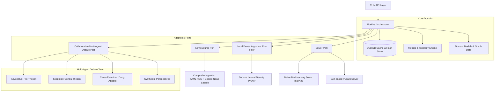

# Technical Specification: Automated Argumentation Reasoning Engine (`clashpy`)

## 1. System Overview & Objectives

**`clashpy`** is an automated pipeline and CLI tool designed to extract, formalize, evaluate, and synthesize argumentation structures from heterogeneous textual and news sources.
It bridges modern Large Language Models (LLM) with formal mathematical artificial intelligence (**Dung's Abstract Argumentation Frameworks**) to discover underlying conflicts, defensible perspectives (extensions), topological metrics, and synthesis theses.

### Core Architectural Principles
- **Hexagonal Architecture (Ports & Adapters)**: Clear decoupling between domain core logic, data ingestion sources, formal solvers, and LLM orchestration.
- **Collaborative Multi-Agent Debate Engine**: Dissects discourse extraction into specialized adversarial roles (**Advocatus** for supportive claims, **Skeptiker** for counter-theses, and **Cross-Examiner** for strict Dung attack inference) to guarantee balanced 50:50 perspective diversity.
- **Sub-Millisecond Dense Argument Pre-Filter**: High-speed local classifier running on CPU/Neural Engine to strip noise, cookies, and boilerplate, cutting LLM token volume by ~75%.
- **Local & Offline Execution (Apple Silicon / Metal)**: Zero-cost offline execution with local LLMs (Qwen 2.5 7B/14B via Ollama) and sub-second TTFT.
- **Determinism & Cost Control**: Complete SHA-256 payload caching via an embedded analytical database (DuckDB).
- **Open/Closed Principle**: New solvers (e.g. SAT, ASP) or ingestion sources can be added without modifying the core pipeline orchestrator.
- **Portability & CLI-first**: Seamless execution via standalone CLI, script, or library imports.

### Mandatory Technology Constraints
To ensure deterministic execution, maintainability, and clean reproducibility:
1. **Package & Environment Management (`uv`)**:
   - `uv` is the mandatory tool for virtualenvs, dependency locking, and execution.
   - Standard PEP 517/621 `pyproject.toml` with `hatchling` as build backend.
   - No legacy `requirements.txt` or proprietary `poetry.lock` formats.
2. **Schema Validation & Type Safety (`pydantic >= 2.x`)**:
   - All domain models must be implemented as strict Pydantic `BaseModel` classes.
   - Enforce typed structured outputs from LLMs via `pydantic-ai`.
3. **Analytical Cache (`duckdb`)**:
   - DuckDB provides local caching to eliminate latency and reduce LLM expenses.

---

## 2. Anti-Patterns & Negative Constraints (What NOT to Do)

1. **No Monolithic Scripting**:
   - Do not merge solver algorithms, news ingestion, caching, and reporting into a single large script.
2. **No Module-Level Eager Agent Instantiation**:
   - LLM agents must **never** be instantiated at module import time (prevents crashes when API keys are resolved later from keyrings or `.env`).
   - Agents must always be instantiated lazily via factory functions.
3. **No Heavyweight Orchestration Frameworks**:
   - Do not import LangChain, LlamaIndex, or AutoGen. `pydantic-ai` provides sufficient structured orchestration with minimal overhead.
4. **No Legacy Dependency Managers**:
   - Do not introduce `pipenv`, `poetry`, or raw `requirements.txt`.
5. **No Hallucinated Source URLs in Prompts**:
   - System prompts must strictly forbid URL extrapolation. If no direct link exists, output `"KEINE_QUELLE"`.
6. **No Hardcoded Secrets**:
   - API keys must never be committed to Git. Resolution order: `os.environ` → `.env` → OS Keyring.
7. **No Uncached LLM Invocations**:
   - Every extraction and synthesis LLM call must be preceded by a DuckDB cache check.
8. **No In-Place Mutations in Core Solvers**:
   - Functions in `core/solver.py` and `core/metrics.py` must remain pure functions without mutating input data.

---

## 3. Architecture & Component Model



### 3.1 Directory Structure
```
clashpy/
├── pyproject.toml
├── sources.yaml                 # Multi-perspective news sources (International, National, Tech, Business)
├── spec/
│   └── system_specification.md  # Comprehensive technical specification
├── docs/
│   ├── poster_en.pdf            # High-resolution architectural infographic (PDF)
│   ├── poster_en.png            # High-resolution architectural infographic (PNG)
│   └── poster_en.html           # Interactive poster template (SVG/CSS)
├── tests/
│   ├── test_collaborative_agents.py # Unit tests for Advocatus, Skeptiker & Cross-Examiner
│   ├── test_dense_filter.py     # Unit tests for sub-ms dense argument pre-filter
│   ├── test_core.py             # Unit tests for Dung semantics, solvers, and metrics
│   ├── test_cytoscape.py        # Unit tests for Cytoscape elements and HTML generation
│   ├── test_sources.py          # Unit tests for YAML config and Search adapters
│   └── test_rss_source.py       # Unit tests for parallel RSS ingestion and timeouts
└── src/
    └── clashpy/
        ├── core/                # Domain models, DuckDB cache, hashing, solvers & metrics
        │   ├── models.py        # Pydantic domain models (Argument, Attack, AF, Lists)
        │   ├── hashing.py       # Deterministic key generation & secret resolution
        │   ├── cache.py         # Generic DuckDB cache interface
        │   ├── solver.py        # Abstract solver protocol & naive backtracking (max=35)
        │   └── metrics.py       # Acceptance scores, degrees, dilemma axes
        ├── adapters/            # Interchangeable ports & adapters (News, Solvers, Classifiers)
        │   ├── classifiers/
        │   │   └── dense_filter.py # Local CPU/Neural Engine argument density classifier
        │   ├── news_sources/
        │   │   ├── base.py
        │   │   ├── sources_config.py
        │   │   ├── search_source.py
        │   │   ├── composite_source.py
        │   │   └── rss_source.py
        │   └── solvers/
        │       └── pygarg_solver.py
        ├── llm/                 # Lazy-initialized collaborative debate agent factories
        │   └── agents.py
        ├── cytoscape.py         # Cytoscape.js graph converter, JSON & HTML dashboard
        ├── pipeline.py          # End-to-end workflow orchestration
        ├── cli.py               # Command-line interface & export router
        └── doc_generator.py     # Automated visual poster & doc generator
```

---

## 4. Mathematical Foundations & Domain Models

### 4.1 Dung's Abstract Argumentation (1995)
An Argumentation Framework is a pair $AF = (A, R)$:
- $A$ is a finite set of arguments.
- $R \subseteq A \times A$ is a binary attack relation ($(a, b) \in R$ denotes $a$ attacks $b$).

### 4.2 Domain Models (`core/models.py`)

```python
class Argument(BaseModel):
    id: str                 # Unique ID, e.g. "A1"
    claim: str              # Concise thesis / assertion
    source_url: str         # Source URL or "KEINE_QUELLE"

class Attack(BaseModel):
    attacker_id: str
    target_id: str
    reason: str             # Contextual reason for conflict

class ArgumentList(BaseModel):
    arguments: List[Argument]

class AttackList(BaseModel):
    attacks: List[Attack]

class ArgumentationFramework(BaseModel):
    topic: str
    arguments: List[Argument]
    attacks: List[Attack]

class Semantics(str, Enum):
    CONFLICT_FREE = "CF"
    ADMISSIBLE = "AD"
    COMPLETE = "CO"
    PREFERRED = "PR"        # Default semantics
    GROUNDED = "GR"
    STABLE = "ST"
    IDEAL = "ID"
    SEMI_STABLE = "SST"

class GroupThesis(BaseModel):
    group_id: int
    thesis: str
    title: str

class FullAnalysisResult(BaseModel):
    theses: List[GroupThesis]
```

---

## 5. Component Specifications

### 5.1 Ingestion & Topic-Targeted Search (`adapters/news_sources/`)
- **Composite News Ingestion (`composite_source.py`)**: Merges curated multi-category RSS feeds (international, national, business, tech) from `sources.yaml` with deep topic-targeted searches (Google News DE + EN).
- **Fair Round-Robin Interleaving**: Prevents single-feed dominance by sampling articles reihum across all responsive feeds.
- **Strict Topical Gating**: Discards off-topic articles lacking inquiry keywords to prevent irrelevant news contamination.

### 5.2 Local Argument Density Pre-Filter (`adapters/classifiers/dense_filter.py`)
- **Sub-Millisecond Classification**: Runs on CPU/Neural Engine prior to LLM calls.
- **Multilingual Discourse Markers**: Scans for causal (*"weil", "studie belegt", "evidence"*), contrastive (*"jedoch", "kritisiert", "however"*), and impact terms (*"risiko", "kosten", "productivity"*).
- **Boilerplate Pruning**: Strips cookies, disclaimers, and newsletter noise, reducing prompt tokens by ~75%.

### 5.3 Collaborative Multi-Agent Debate Architecture (`llm/agents.py`)
- **Advocatus Agent (Pro)**: Parallel extraction of supportive theses and positive evidence.
- **Skeptiker Agent (Contra)**: Parallel extraction of counterarguments, risks, and economic/ethical constraints.
- **Deduplicator & Indexer**: Unifies and normalizes claims into structured identifiers (`A1, A2, A3...`).
- **Cross-Examiner Agent**: Pairwise verification of logical refutations ($A \rightarrow B$) and mutual dilemma axes ($A \leftrightarrow B$).
- **Synthesis Agent**: Generates concise, objective perspective summaries without ranking.

### 5.4 Solvers & Capacity (`core/solver.py`, `adapters/solvers/`)
- **Naive Backtracking Solver**: Built-in exponential solver with conflict-free pruning; supports up to 35 arguments (`--naive-max-arguments 35`).
- **Pygarg Solver (`adapters/solvers/pygarg_solver.py`)**: High-performance SAT-based solver for large-scale graphs (50+ arguments) supporting all ICCMA semantics.

### 5.5 Graph Metrics & Topology (`core/metrics.py`)
1. **Argument Acceptance Score**:
   $$Score(a) = \frac{|\{E \in \mathcal{E} \mid a \in E\}|}{|\mathcal{E}|}$$
2. **Classification**:
   - `core`: $Score = 1.0$ (universal consensus across extensions).
   - `contested`: $0.0 < Score < 1.0$ (perspective-dependent debate).
   - `excluded`: $Score = 0.0$ (dominated / refuted).
3. **Dilemma Axes**: Detects mutual attacks ($A \leftrightarrow B$) denoting fundamental trade-offs.

---

## 6. CLI & Export Specification (`cli.py`)

```bash
uv run clashpy [TOPIC] [OPTIONS]
```

| Flag | Description | Default |
| :--- | :--- | :--- |
| `topic` / `--topic` | Inquiry or debate topic | `""` |
| `--model` | LLM model identifier (supports Google, OpenAI, Anthropic, Ollama/Apple Silicon, DeepInfra) | `google:gemini-3.5-flash` |
| `--solver` | Solver algorithm (`naive` or `pygarg`) | `naive` |
| `--semantics` | Formal semantics (`PR`, `ST`, `CO`, `GR`) | `PR` (Preferred) |
| `--naive-max-arguments` | Max arguments for naive solver | `35` |
| `--max-articles` | Max news articles aggregated for extraction | `60` |
| `--dense-filter` / `--no-dense-filter` | Enable/disable sub-ms local argument density pre-filter | `True` |
| `--search` / `--no-search` | Enable/disable deep Google News topic search | `True` |
| `--search-time` | Search horizon (e.g. `7d`, `14d`, `30d`) | `30d` |
| `--export-md [FILE]` | Export structured Markdown analysis report to `output/` | Disabled |
| `--export-html [FILE]` | Export interactive Cytoscape.js HTML visualization dashboard | Disabled |
| `--export-cytoscape [FILE]` | Export Cytoscape.js graph JSON payload to `output/` | Disabled |
| `--export-mmd [FILE]` | Export Mermaid graph to `output/` | Disabled |
| `--output-json [FILE]` | Export complete raw JSON analysis payload | Disabled |
| `--refresh` | Bypass DuckDB cache and force fresh execution | `False` |

---

## 7. Re-Implementation Blueprint for AI Agents

1. **Bootstrap with `uv`**:
   `uv init --lib clashpy && uv add duckdb pydantic pydantic-ai feedparser python-dotenv keyring watchdog`
2. **Core Modeling**:
   Implement `core/models.py`, `core/hashing.py`, and `core/cache.py`.
3. **Solver Algorithms**:
   Implement backtracking search in `core/solver.py` and graph metrics in `core/metrics.py`.
4. **Ingestion Adapter**:
   Implement `adapters/news_sources/rss_source.py`.
5. **Agent Factories**:
   Configure lazy Pydantic-AI agents in `llm/agents.py`.
6. **Pipeline & CLI**:
   Wire components via `pipeline.py` and expose CLI shortcuts in `cli.py`.
